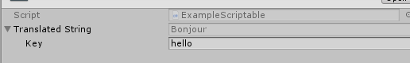

# Text translations For Unity

[![Contributors][contributors-shield]][contributors-url]
[![Forks][forks-shield]][forks-url]
[![Stargazers][stars-shield]][stars-url]
[![Issues][issues-shield]][issues-url]
[![MIT License][license-shield]][license-url]

## Table of Contents

* [Getting Started](#getting-started)
  * [Prerequisites](#prerequisites)
  * [Installation](#installation)
* [Usage](#usage)
* [Roadmap](#roadmap)
* [Contributing](#contributing)
* [License](#license)

## Getting Started

### Prerequisites

* Unity 2018.1 and above.

### Installation

1. Open the `manifest.json` in your project

2. Specify the package URL

```json
{
  "dependencies": {
    "com.arsenstudio.i18n": "https://github.com/intelligide/unity-i18n.git"
}
```

3. Open your project or reload it in the Unity Editor

## Usage

First, write your language manifest. It's really simple.

```xml
<?xml version="1.0" encoding="utf-8"?>
<resources lang="en">
    <string key="my_string">My string</string>
</resources>
```

You must write one manifest per language and put them on a directory named `Resources/I18n`.

You can load translations with `LanguageManager`.

```csharp
ArsenStudio.I18n.LanguageManager.Load("en")
```

Then, translate like this:


```csharp
ArsenStudio.I18n.LanguageManager.Tr("my_string") // Returns "My string"
```

### TranslatableString

```csharp
ArsenStudio.I18n.TranslatableString
```

Translatable strings have custom editors.

```csharp
using ArsenStudio.I18n;
using UnityEngine;

[CreateAssetMenu(fileName = "Data", menuName = "ScriptableObjects/ExampleScriptable", order = 1)]
public class ExampleScriptable : ScriptableObject
{
    public TranslatableString TranslatedString;
}
```



### TranslatableText, TranslatableTextMesh, TranslatableTextMeshPro, TranslatableTextMeshProGUI components

These components are useful for translating Txt components. Put them on the same gameobject as text components.

## Roadmap

See the [open issues](https://github.com/intelligide/unity-i18n/issues) for a list of proposed features (and known issues).

## Contributing

Contributions are what make the open source community such an amazing place to be learn, inspire, and create. Any contributions you make are **greatly appreciated**.

1. Fork the Project
2. Create your Feature Branch (`git checkout -b feature/AmazingFeature`)
3. Commit your Changes (`git commit -m 'Add some AmazingFeature'`)
4. Push to the Branch (`git push origin feature/AmazingFeature`)
5. Open a Pull Request

## License

Distributed under the MIT License. See [LICENSE](LICENSE.txt) for more information.

[contributors-shield]: https://img.shields.io/github/contributors/intelligide/unity-i18n.svg?style=flat-square
[contributors-url]: https://github.com/intelligide/unity-i18n/graphs/contributors
[forks-shield]: https://img.shields.io/github/forks/intelligide/unity-i18n.svg?style=flat-square
[forks-url]: https://github.com/intelligide/unity-i18n/network/members
[stars-shield]: https://img.shields.io/github/stars/intelligide/unity-i18n.svg?style=flat-square
[stars-url]: https://github.com/intelligide/unity-i18n/stargazers
[issues-shield]: https://img.shields.io/github/issues/intelligide/unity-i18n.svg?style=flat-square
[issues-url]: https://github.com/intelligide/unity-i18n/issues
[license-shield]: https://img.shields.io/github/license/intelligide/unity-i18n.svg?style=flat-square
[license-url]: https://github.com/intelligide/unity-i18n/blob/master/LICENSE.txt
